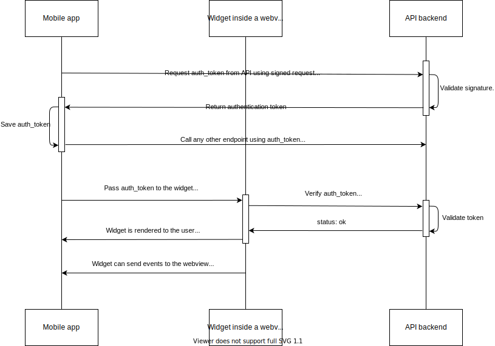
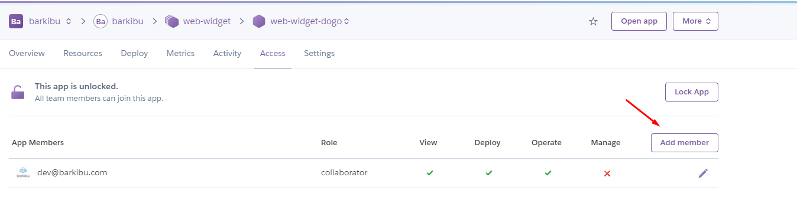

# Web widget chat app

A web app that uses [AngularDart](https://angulardart.dev)


## Setup requirements

- [Dart SDK](https://dart.dev/get-dart)

## Configuration

[docs/widget_configuration.md](./docs/widget_configuration.md)

## Setup instructions

- `pub global activate webdev 2.6.2`
- `cp build.example.yaml build.yaml`
- Adjust configuration if needed in `build.yaml` file
- `pub get`
- `webdev serve`

Chat widget page will be available at `http://localhost:8080`. And example of client page with injected widget is available at `http://localhost:8080/client_page_local.html`.

## Known issues

### Handling exceptions in MapEventToState method

Bloc will stop processing incoming events after exception is catched inside MapEventToState method. Run app in release mode `webdev serve -r` to overcome this issue. `dart2js` is used in this mode and it doesn't have this issue(unlike `dartevc` used in `webdev serve`). Keep in mind that `dart2js` is considerably slower, so use it only if this issue is blocking you.

- Root cause: https://github.com/dart-lang/sdk/issues/39994
- Example in bloc repo: https://github.com/felangel/bloc/issues/521
- Another example: https://github.com/felangel/bloc/issues/345

### Run the project locally on Windows 10

Seems that the way build runner is auto generating the tests files in .dart_tool directory makes the test build crash in Windows 10, so It makes you not be able to launch the tests from your Windows machine, current solution for this is work using WSL from your Windows Enviroment and setting up the project over a linux distribution, you can find how to set up everything to make it work over linux reading this doc.

- Doc with steps: https://www.notion.so/Web-widget-issue-in-Windows-f6ccccab74b4469e93cce270145527ee
## Testing

Tests are setup according to the [official guide](https://angulardart.dev/guide/testing/component). To run tests

```
pub run build_runner test --fail-on-severe -- -p chrome
```

To debug tests in browser run them using `--pause-after-load`. This will open browser and pause tests execution until you click "Play" button. It gives you time to setup breakpoints. Example:

```
pub run build_runner test --fail-on-severe -- -p chrome --pause-after-load test/profile_edit_test.dart
```

## Deployment

To deploy your changes you can use GitHub actions:

- Go to `Web Widget Deploy` action in githib [repo](https://github.com/barkibu/web-widgets/actions?query=workflow%3A%22Web+Widget+Deploy%22)
- Click "Run workflow"
- Select branch to be deployed an an environment where you wish to deploy your changes

More info on github's manual triggers of worflows can be found [here](https://levelup.gitconnected.com/how-to-manually-trigger-a-github-actions-workflow-4712542f1960)

Alternatively you can run `script/deploy` that will deploy your current branch to the heroku without running any tests. You need to have `heroku-cli-static` plugin installed locally in order for deploy script to work:

- `heroku plugins:install heroku-cli-static`
- `script/deploy prod` Will deploy here: https://web-widget.herokuapp.com
- `script/deploy $env_name` Will deploy here: https://web-widget-$env_name.herokuapp.com

## Create new deployment

To set up a new deployment follow these steps:

- Create a new application in heroku
- Make sure you've got `heroku cli` installed and you've logged in to heroku
- Enable static buildpack for the new app `heroku buildpacks:set https://github.com/hone/heroku-buildpack-static --app created_app_name`

Full guide on how to setup static buildpack + heroku is [here](https://gist.github.com/hone/24b06869b4c1eca701f9). Also you can refer to buildpack's [readme](https://github.com/heroku/heroku-buildpack-static/blob/master/README.md).

## Release process/branching

Use gitflow: https://www.atlassian.com/git/tutorials/comparing-workflows/gitflow-workflow

In a nut shell:

- Features go in develop branch
- Hotifxes go in master and backmerged in develop
- Release branches can be used for preparing a release and codefreezing
- When release is ready to be deployed - create a commit that increments a version and tag it with release number

List of releases: https://github.com/barkibu/web-widgets/releases

When creating an "increment version" commit make sure to increment the version in:

- `pubspec.yaml`
- `web/version`
- `CHANGELOG.md`

## Caching

Cache control headers are provided in `static.json` file for each asset.

All app assets are served with `Cache-Control` header value `public max-age=31536000`. This allows browsers to cache the response. To invalidate browser cache on deployment a `built_html` package is used. It allows to inject assets digest into `html` and `json` files. So in `index.template.html` main script is loaded like this:

```html
<script defer src="main.dart.js?q={{digest main.dart.js}}"></script>
```

Whenever the content of `main.dart.js` changes the browser will be not use cache because of different query url parameter. Also an asset digests map is generated from `assets.template.json` file. It contains digests of other assets that are used by the widget. Loader script will first fetch assets versions and add their digest to query string when injecting them on the client page:

```javascript
assetsMap = fetch('assets.json');
scriptElement.src = '//' + hostName + '/loader.js' + '?v=' + assetsMap['loader.js'];
```

## Integrating widget on the page

In order to embed widget into the page you'll have to add an inject script on to the page. An example of minified and non-minified scripts are provided in `web/client_page_prod.html` and `web/client_page_local.html`. The only difference between these two scrips is that they will use widget code from different sources(staging and localhost).

Inject script can accept different arguments:

```javascript
/**
 * @param {object} window - Reference to window object to make method shorter.
 * @param {object} document - Reference to the element that will contain the script tag and to make method shorter.
 * @param {string} scriptTagName - Contains the word 'script' to make method shorter.
 * @param {string} scriptHost - The address of the main script that we need to load.
 * @param {string} globalName - This allows dynamically define global variable name to avoid conflicts with other SDKs.
*/
```

3 arguments are used to make minimised script smaller, last two arguments can be customized to provide different widget deployment location and custom global name. After the inject script code you'd have to make a call to initialize widget.

```javascript
// in this example `globalName` param was set to `"vetChatWidget"` in inject script
// so widget api is available as `window.vetChatWidget`
vetChatWidget.send('init', { client_id: 'CLIENT_ID', locale: 'es-MX', country: 'MX', theme: 'alternative' });
```

It will add an iframe to the page and start the angular application within it. Once application is loaded you can make other calls to widget api.

Configuration options:

- `client_id` - Mandatory. Unique identifier of the client. Used for analytics, error tracking and changing widget functionality. Refer to `clientId` in [docs/widget_configuration.md](./docs/widget_configuration.md)
- `locale` - Optional. Will be determined by browser settings if not provided. Refer to `locale` in [docs/widget_configuration.md](./docs/widget_configuration.md)
- `country` - Optional. It will not be determined if not provided.
- `theme` - Optional. Defines widget visual style, and if not provided `default` value will be used.
- `auth_token` - Optional. A value of authentication token that will sign in user into the widget. Refer to `externalAuthToken` in [docs/widget_configuration.md](./docs/widget_configuration.md)
- `otp_token` - Optional. A value of One Time Passcode token that will sign in user into the widget. Refer to `externalAuthToken` in [docs/widget_configuration.md](./docs/widget_configuration.md)

Note: there's currently no way to determine when application is loaded. Any calls to widget api(except `init`) before widget is loaded will not have effect.

```javascript
vetChatWidget.send('open'); // Opens a widget window
vetChatWidget.send('close'); // Closes a widget window
```

## External users authentication

In case users are managed externaly - widget supports authentication using a token provided in query parameters. Web service or native mobile app that is hosting the widget can use API to generate auth_token and pass it to the widget. Below is the chart describing a process



## Widget theming

Widget supports customization using themes. Theme can be passed to the `init` call as an option

```javascript
vetChatWidget.send('init', { client_id: 'CLIENT_ID', theme: 'theme_name' });
```

or it can be passed directly via query, in case inject script is not used:

```
https://web-widget-host.com/?theme=theme_name
```

To implement a theme you can take a look at one of the already implemented themes: [default](lib/src/scss/_default_theme.scss) or [alternative](lib/src/scss/_alternative_theme.scss). They contain a list of colours that define a base for a theme. Once these colours are defined a theme has to be created in [_themes.scss](lib/src/scss/_themes.scss) file. In case widget is embeded into the web-page using an inject script - you'll need to add an icon for the floating button that opens a widget. Example for [default](web/assets/images/widget-icon-default.svg) themes.

# How configuration works on Widget project

In order to have different ways to customize our product, in kind of a way of implementing a multi-tenant solution, we implemented a solution based on config files, which contain some feature flags, that allow us to manage the way that components are presented and behavior of the widget itself.

## How this works?

You can reach in the root folder of the widget project several **yaml** files as for example:

- ⚠ Example here

    ```yaml
    targets:
      $default:
        builders:
          web_widget|config_builder:
            options:
              # Authentication options
              authByEmailEnabled: true
              useLegacyAuthDatasource: true
              authServiceAppClientId: null
              authServiceUserPoolId: null
              externalProfileDataEnabled: false

              # Basic features
              telehealthEnabled: true
              telehealthVideoCapabilityEnabled: false
              telehealthMediaSharingEnabled: false
              nutribotEnabled: true
              askAVetDirectlyEnabled: true
              aivetEnabled: true

              # Customisation
              externalPetDataEnabled: false
              externalLinksEventsEnabled: false
              embeddedEmailClientEnabled: false
              nutribotRecommendationShortJourneyEnabled: false
              addPetOptionEnabled: true
              extendedFeedbackEnabled: true
              closeButtonEnabled: true
              backButtonEnabled: true
              goHomeLinkEnabled: true
              footerChatCreditsEnabled: false
              aivetUrgencyOrderEnabled: false
              skipPrimarySymptomEnabled: false
              termsOfServiceHomeEnabled: false
              lastNameRequired: false
              petBreedEnabled: false
              assessmentDateFormat: dd/MM/yyyy
              defaultPhonePrefix: null
              appName: 'Barkibu Assistant'
              brandName: 'Barkibu'
              brandLogo: 'barkibu-logo.svg'
              brandLogoWidth: '70px'
              headerWithoutLogo: false
              botPreMessageDelay: 2000
              botPostMessageDelay: 1200
              useSpecialTranslations: 'default'
              virtualVetInfoEnabled: false
              externalToSEnabled: false

              # Fallback theme & client_id
              fallbackTheme: 'default'
              fallbackClientId: null

              # Contanct vet options
              chatWithVetEnabled: true
              chatOnPhoneCallUrl: https://my-calendly-url?name={userName}&email={userEmail}&a3={petAge}&a4={petSpecies}&a1={fullPhoneNumber}
              emailAccount: vet.help@mail.barkibu.com

              # System configuration
              envName: 'development'
              apiUrl: 'https://yourapi.example.com/v2'
              segmentWriteKey: 'segmentWriteKey'

              # Overriden configuration for each client id

              clientIdConfigOverride:
                # Open widget with ?client_id=some_client_id_1 query to apply custom config
                some_client_id_1:
                  nutribotEnabled: false
                  aivetEnabled: false
                  appName: 'Some client ID 1'
                  brandName: 'Some client ID 1'
                # Open widget with ?client_id=some_client_id_2 query to apply custom config
                some_client_id_2:
                  fallbackTheme: alternative
                  appName: 'Some client ID 2'
                  brandName: 'Some client ID 2'

    builders:
      config_builder:
        import: "package:web_widget/builders/config_builder.dart"
        builder_factories: ["configBuilder"]
        build_extensions:
          "$lib$": ["config.g.dart"]
    ```

As you can see in the end of the file, there's a build that reads this config file, to build it into a understandable and manageable config in dart language you can reach the builded file once you run your project here:

**.dart-tool > generated > web_widget > config.g.dart**

You will we able to see there a generated file with different const given the keys and values of your current configuration file in the **build.yaml**

Later this values are managed in the code by using the **WidgetConfiguration** class we're you will see a list of different getters that reads from the generated **config.g.dart** *and other legacy configurations that where shared between app and widget when we use the common_lib repo*

## ClientIdOverridenValue wtf is this?

May sound weird to you on first time see this on the config file but do not panic, take some coffee and keep reading 😊

Sometimes we have partners that have tiny specifications or basically are the same widget with some tiny change as for example using keep using the current legacy datasource for auth users, In other to make this possible and avoiding having hundreds of yaml files and deployments, we have the option to indicate when we generate the script a client_id for that specific partners, based on that, we can override values of the configuration based on the client_id.

You can see and example on the **build.prod.yaml** file 😇

## And finally... how is this deployed based on each configuration?

So basically, you can see on the root directory a folder called, **script**, which contains a [**deploy.sh](http://deploy.sh)** file this file is the one of being called in our current github actions flow to build the whole application

```bash
DEPLOY_ENV=$1

if [ $DEPLOY_ENV == "prod" ]; then
  DEPLOY_APP="web-widget";
else
  DEPLOY_APP="web-widget-${DEPLOY_ENV}";
fi

pub run build_runner build --output web:build --release --config $DEPLOY_ENV &&
  rm -rf build/packages &&
  heroku static:deploy --app $DEPLOY_APP
```

—config flag gets the generated configuration for each partner and deploy env indicates to which instance in heroku deploy the widget we follow the current naming conventions for widget instances in heroku and widget yaml files.

1. web-widget-{enviroment}
2. build.{partner-name}-{staging(or ignore for production)}.yaml

To not deploy it manually and let the machines 🤖🤖🤖🤖 do the work for you remember this:

**Grant access to your account dev@mail.com account in your current heroku instance**

You can do that by doing the following

1. Go to your widget instance in heroku
2. Selecting the access tab
3. Clicking in add member button and adding "dev@mail.com" with operate and deploy permissions



