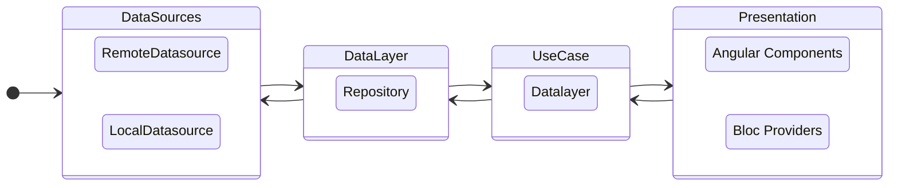

# Web-Widget architecture

## General overview
This is an Angular App with a dart based development

- **Data Sources layer:** as name states, here we handle the data sources (local and remote) here is where we make the calls to the backend or database queries
- **Data Layer or Repository:** In this layer we abstract where the data comes from and provide it to the presentation layer through use cases
- **UseCase:** In this layer we describe the use cases required by the presentation layer to get the correctly formatted data
- **Presentation layer:** This layer is separated in two
    - UI layer which are actually Angular components
    - [BLOC Providers](https://bloclibrary.dev/#/) which are the ones responsible for handling the app's state. State management is handled using Bloc.

## Layer dissection

### Datasource layer
This layer is the one providing data. Data can come from a network source or a database
Network datasource uses [Chopper](https://hadrien-lejard.gitbook.io/chopper/)  as Http client.

### Data layer or Repository
This layer handles the abstraction between data origin and provides it to the presentation layer.

### Presentation Layer
For state handling app uses Bloc as mentioned before.

For the UI layer elements are divided in common reusable components used across different screens.

## Multi language strategy

We use the [i18n](https://pub.dev/packages/i18n) package to be able to handle several languages within the application.

Translations are generated from yaml files in /lib/messages, and converted to plain Dart classes.