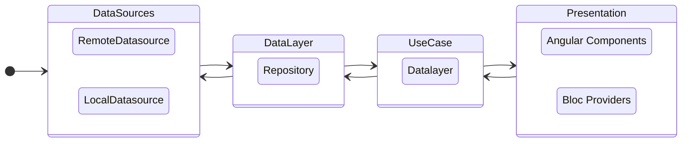

# Web-Widget architecture

## General overview
This is an Angular App with a dart based development

- **Data Sources layer:** as name states, here we handle the data sources (local and remote) here is where we make the calls to the backend or database queries
- **Data Layer or Repository:** In this layer we abstract where the data comes from and provide it to the presentation layer through use cases
- **UseCase:** In this layer we describe the use cases required by the presentation layer to get the correctly formatted data
- **Presentation layer:** This layer is separated in two
    - UI layer which are actually Angular components
    - [BLOC Providers](https://bloclibrary.dev/#/) which are the ones responsible for handling the app's state. State management is handled using Bloc.

## Layer dissection

### Datasource layer
This layer is the one providing data. Data can come from a network source or a database
Network datasource uses [Chopper](https://hadrien-lejard.gitbook.io/chopper/)  as Http client.

### Data layer or Repository
This layer handles the abstraction between data origin and provides it to the presentation layer.

### Presentation Layer
For state handling app uses Bloc as mentioned before.

For the UI layer elements are divided in common reusable components used across different screens.

## Multi language strategy

We use the [i18n](https://pub.dev/packages/i18n) package to be able to handle several languages within the application.

Translations are generated from yaml files in /lib/messages, and converted to plain Dart classes.

## UI

The UI is built following the Component Based Development and the DRY (Don't repeat yourself) principle. AngularDart helps us with this idea because it provides us the technology to build components and reuse the code.

The project has small and simple components that are used for more complex components. This allows us to avoid repeating developments and simplify the work when an interface change is required.

### Notes

- As much as possible always try to use pure html instead of third party libraries
- Build sass as modules instead of big scss files

### Styles

We use sass for the components styles

Tips

- Build the sass files as modules for each component

## Testing
All the functionality is tested with Integration and Unit tests. These tests are divided into [Domain Test](/domain/test), where is tested the state management and data management, and [General Test](/test) where we check that the interface is working well and integrated with the Domain.

To build the tests we use the [Official testing library of AngularDart](https://angulardart.xyz/guide/testing) that allows us to create end-to-end test and component testing.

## Tracking Events

The tracking of events and user actions is carried out by a proprietary service called [Analytics Service](domain/lib/services/analytics_service.dart). This services registers the events and isolates the integration with any third-party service (as Google Analytics or Segment), allowing it to be changed easily without impacting the code.

Every screen has its own event methods declared in the folder [/analytics/events](domain/lib/services/analytics/events) that define the specific information the event will require. These methods will be used in the part of the code where you want to register the specific event and after, the [Analytics Service](domain/lib/services/analytics_service.dart) will push the event to the third-party service.

Currently, we are using [Segment](https://segment.com/) as collector of analytic data.

## Twilio integration - third-party integration

Twilio is a platform providing the API that allows our customers to connect by email or phone number and access the chat.

All the integration is managed by the dart files in the [twilio folder](domain/lib/services/twilio).
